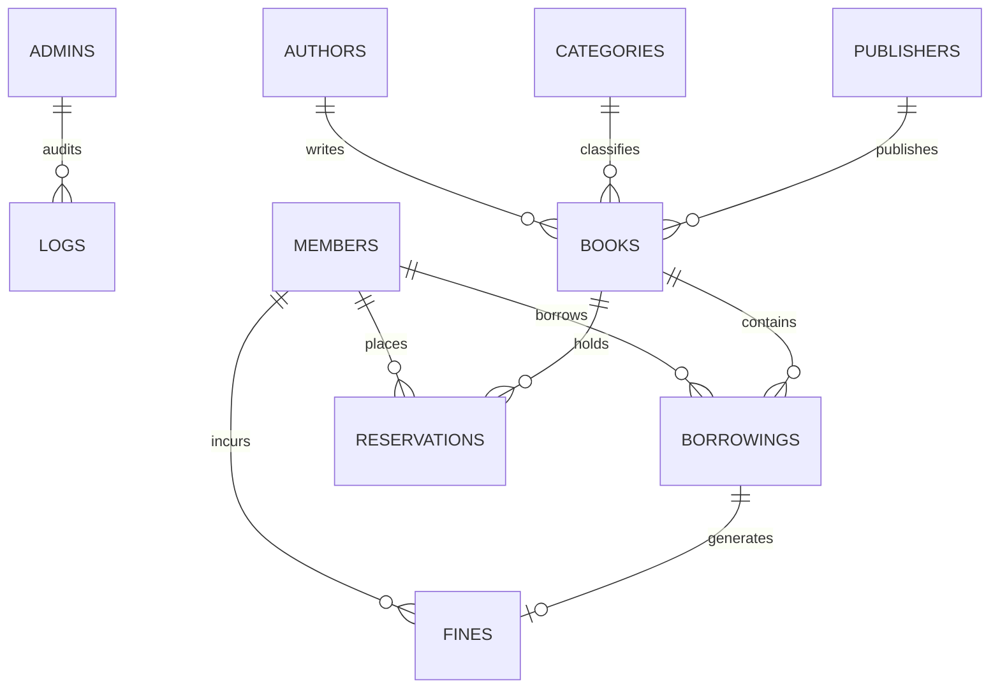

# 📚 Library Management System (CLI-Based)

A complete, enterprise-grade, modular, and secure **Command Line Interface (CLI) Library Management System** developed in **Python 3.x** and **SQLite3**. Built with strict Object-Oriented Programming (OOP) principles, relational database integrity, transaction safety, cryptographically secure authentication, and a polished terminal UI.

---

## 🌟 Key Highlights

- ⚡ **Zero External Dependencies**: Implemented entirely with the Python Standard Library (`sqlite3`, `datetime`, `decimal`, `hashlib`, `getpass`, `csv`, `logging`).
- 🔐 **Hardened Security**: PBKDF2-HMAC-SHA256 password hashing with unique 16-byte cryptographic salts, hidden terminal inputs (`getpass`), parameterized SQL queries to prevent SQL injection, and session-based brute force protection.
- 🔄 **Atomic Transactions & Inventory Synchronization**: Issue and return operations maintain strict quantity consistency (`0 <= available_quantity <= quantity`) with automatic transaction rollbacks on failure.
- 💰 **High-Precision Financial Engine**: Overdue fines calculated to the exact day using Python's `Decimal` precision at `Rs. 20.00 / day`.
- 📊 **Dynamic Analytics & CSV Export**: Real-time admin/member dashboards and full CSV reports export for books, members, borrowings, fines, and reservations.
- 🎨 **Elegant CLI UX**: Unicode box-drawing tables, color-coded status badges, structured cards, clear screen transitions, and graceful `Ctrl+C` exit handling.

---

## 🏗️ Project Architecture & Structure

```text
Library Management System/
│
├── main.py                   # Application entry point & signal handler
├── config.py                 # Centralized configuration constants & business rules
├── database.py               # SQLite DatabaseManager with connection & transaction context
├── seed_data.py              # Automatic demo data seeder (Admin, Catalog, Members, History)
├── requirements.txt          # Python Standard Library zero-dependency declaration
├── README.md                 # Complete documentation & viva reference
├── library_management.db     # SQLite database file (auto-generated)
├── library_management.log    # Comprehensive audit and transaction log
│
├── models/                   # Domain entity data classes
│   ├── __init__.py
│   ├── admin.py              # Admin entity
│   ├── author.py             # Author entity
│   ├── category.py           # Category entity
│   ├── publisher.py          # Publisher entity
│   ├── book.py               # Book entity with relational joins
│   ├── member.py             # Member entity
│   ├── borrowing.py          # Borrowing entity with overdue calculations
│   ├── fine.py               # Fine entity with Decimal currency
│   └── reservation.py        # Reservation entity
│
├── services/                 # Business logic & database operations
│   ├── __init__.py
│   ├── auth_service.py       # Authentication, password hashing, lockout logic
│   ├── book_service.py       # Books, Authors, Categories, Publishers CRUD & Search
│   ├── member_service.py     # Member management, profile update, blocking/unblocking
│   ├── borrowing_service.py  # Issue, return, renew workflows with atomic safety
│   ├── fine_service.py       # Fine computation, listing, and payment processing
│   └── reservation_service.py# Book reservations, hold queues, and fulfillment
│
├── cli/                      # Presentation layer
│   ├── __init__.py
│   ├── main_menu.py          # Gateway portal and login/registration routing
│   ├── admin_menu.py         # Full Admin control center (16 options)
│   └── member_menu.py        # Self-service Member portal (12 options)
│
├── reports/                  # Reporting & export subsystem
│   ├── __init__.py
│   └── report_generator.py   # Statistical analytics & CSV export engine
│
├── data/                     # Output directory for exported CSV reports
│   ├── books_report.csv
│   ├── members_report.csv
│   ├── borrowings_report.csv
│   ├── fines_report.csv
│   └── reservations_report.csv
│
└── tests/                    # Automated Unit & Integration Test Suite
    ├── __init__.py
    └── test_library_system.py# 12 comprehensive test cases covering all business rules
```

---

## 🚀 Quick Start & Installation

### Prerequisites
- Python 3.9 or higher installed on Windows, macOS, or Linux.
- No third-party packages needed (`pip install` is **NOT** required).

### Running the Application

1. Open your terminal or command prompt inside the project folder:
   ```bash
   cd "Library management system"
   ```

2. Run the main script:
   ```bash
   python main.py
   ```

The database (`library_management.db`) and initial seed records will be created automatically on the first run!

---

## 🔑 Demo Credentials

For testing, viva demonstrations, and evaluation, the system comes pre-populated with:

### 1. Administrator Account
- **Username:** `admin`
- **Password:** `admin123`
- **Role:** Chief Librarian / Administrator

### 2. Sample Member Accounts
| Username | Password | Full Name | Member ID | Status | Notes |
|---|---|---|---|---|---|
| `alikhan` | `password123` | Ali Khan | `MEM-1001` | **Active** | Has active non-overdue borrowing |
| `sarahahmed` | `password123` | Sarah Ahmed | `MEM-1002` | **Active** | Has 1 overdue borrowing (fine incurred) |
| `usman` | `password123` | Muhammad Usman | `MEM-1003` | **Active** | Has 1 pending book reservation |
| `fatima` | `password123` | Fatima Noor | `MEM-1004` | **Blocked** | Blocked member (login denied) |

> *Note: You can also register brand-new members directly from the Main Menu.*

---

## 📜 Core Business Rules

| Rule | Configuration Constant | Default Value | Description |
|---|---|---|---|
| **Max Borrowing Limit** | `MAX_BOOKS_PER_MEMBER` | `5` books | A member cannot have more than 5 active issued books at a time. |
| **Borrowing Period** | `DEFAULT_BORROWING_PERIOD_DAYS` | `14` days | Due date is automatically computed as `Issue Date + 14 days`. |
| **Renewal Limit** | `MAX_RENEWALS` | `2` times | A book can be renewed up to 2 times. Cannot renew overdue books. |
| **Overdue Fine Rate** | `FINE_PER_OVERDUE_DAY` | `Rs. 20.00` | Overdue fee = `Overdue Days × Rs. 20.00`. Uses `Decimal` precision. |
| **Duplicate Borrowing** | System Rule | Prohibited | A member cannot borrow two copies of the same book simultaneously. |
| **Stock Consistency** | System Rule | `0 <= Avail <= Total` | `available_quantity` automatically tracks loans and returns. |
| **Safe Deletion** | System Rule | Enforced | Books or members with active borrowings cannot be deleted. |
| **Brute Force Lockout** | `MAX_LOGIN_ATTEMPTS` | `5` attempts | 30-second cooldown after 5 consecutive failed logins. |

---

## 🗄️ Database Schema & Entities

The SQLite database (`library_management.db`) enforces **foreign key constraints** and contains 9 relational tables:



### Table Breakdown

1. **`admins`**: Stores admin credentials (`id`, `username`, `password_hash`, `salt`, `full_name`, `email`, `created_at`).
2. **`members`**: Stores library members (`id`, `member_id`, `full_name`, `cnic`, `phone`, `email`, `address`, `username`, `password_hash`, `salt`, `status`, `created_at`).
3. **`authors`**: Catalog authors (`id`, `name`, `biography`, `created_at`).
4. **`categories`**: Book categories (`id`, `name`, `description`, `created_at`).
5. **`publishers`**: Publishing houses (`id`, `name`, `contact`, `email`, `address`, `created_at`).
6. **`books`**: Book catalog (`id`, `isbn`, `title`, `author_id`, `category_id`, `publisher_id`, `publication_year`, `edition`, `quantity`, `available_quantity`, `shelf_location`, `status`, `created_at`).
7. **`borrowings`**: Issue/return records (`id`, `borrowing_id`, `member_id`, `book_id`, `issue_date`, `due_date`, `return_date`, `renewal_count`, `status`, `created_at`).
8. **`fines`**: Late fee records (`id`, `borrowing_id`, `member_id`, `amount`, `reason`, `status`, `created_at`, `paid_at`).
9. **`reservations`**: Book holds (`id`, `reservation_id`, `member_id`, `book_id`, `reservation_date`, `status`, `created_at`).

---

## 🧪 Automated Testing

A complete automated unit and integration test suite is located in `tests/test_library_system.py`.

Run tests with:
```bash
python -m unittest discover -s tests -p "test_*.py"
```

### What is Tested:
- ✅ PBKDF2-HMAC password hashing & salt verification
- ✅ Regex validators (ISBN-10/13, CNIC, Phone, Email, Year, Numbers)
- ✅ Admin & Member authentication + session brute-force lockout
- ✅ Member registration, duplicate username/ID prevention & blocking
- ✅ Authors, Categories, Publishers & Book CRUD operations
- ✅ Quantity synchronization (`available_quantity` vs total `quantity`)
- ✅ Borrowing limit enforcement (maximum 5 active books)
- ✅ Duplicate active borrowing prevention
- ✅ Overdue day calculation & automated `Decimal` fine generation
- ✅ Renewal count limits (<= 2) and overdue renewal restrictions
- ✅ Book hold reservations, queue prevention & fulfillment
- ✅ Fine settlement & payment recording
- ✅ CSV export generation for all 5 entity reports

---

## 📋 Viva & Academic Questions Guide

### Q1: Why did you choose SQLite3 and Python Standard Library?
**Ans:** SQLite3 provides a robust, zero-configuration ACID-compliant relational database engine that runs locally without external database server setups. Keeping external dependencies to zero ensures the project is portable, highly maintainable, and runnable on any environment with Python installed.

### Q2: How is password security implemented?
**Ans:** Passwords are never stored in plain text. We utilize `hashlib.pbkdf2_hmac` with SHA-256 and 100,000 iterations along with a unique 16-byte random cryptographic salt (`os.urandom`) generated per user. Verification is performed using `hmac.compare_digest` to prevent timing attacks.

### Q3: How do you prevent race conditions or partial updates during book issuing/returning?
**Ans:** All multi-step operations (e.g. checking member limit, inserting borrowing record, and decrementing book available quantity) are executed inside atomic SQLite transactions using Python context managers (`with db.transaction() as conn:`). If any step fails, the entire transaction is rolled back.

### Q4: How is inventory consistency maintained when updating a book's total quantity?
**Ans:** The system calculates currently issued copies (`issued = total_quantity - available_quantity`). If an admin attempts to lower total quantity below currently issued copies, the operation is rejected. When total quantity increases, `available_quantity` is automatically adjusted.

---

## 🔮 Future Enhancements

- 🌐 Web Application Interface (FastAPI / Next.js REST architecture)
- 📱 Mobile App integration for digital student library cards
- 🏷️ Barcode & RFID scanner hardware integration
- 📧 Automated Email & SMS overdue notification webhooks
- 🏢 Multi-branch library federation support

---

## 📄 License & Credits

Developed as a Semester Project in Object-Oriented Software Engineering & Database Systems.
Licensed under the **MIT License**.
